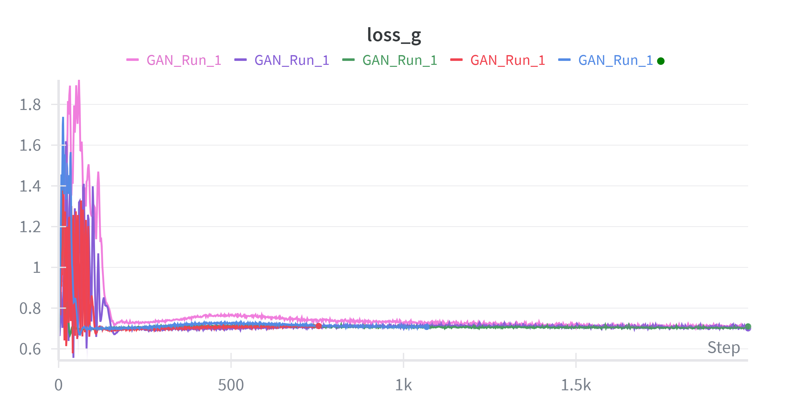
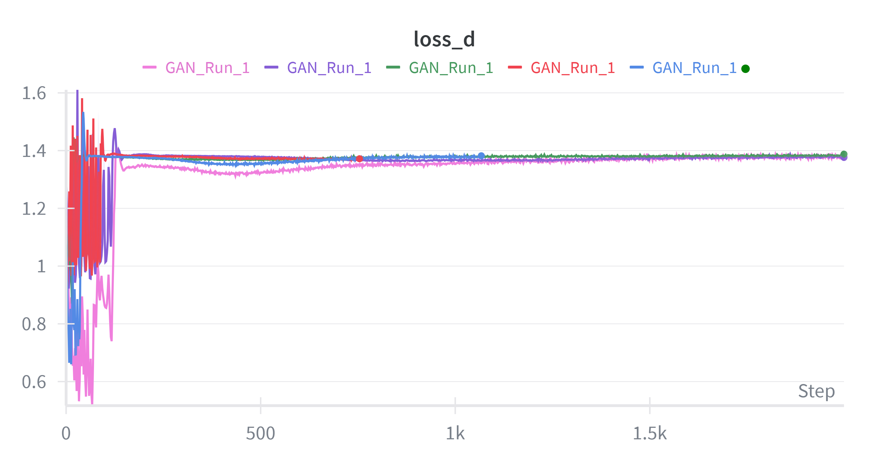
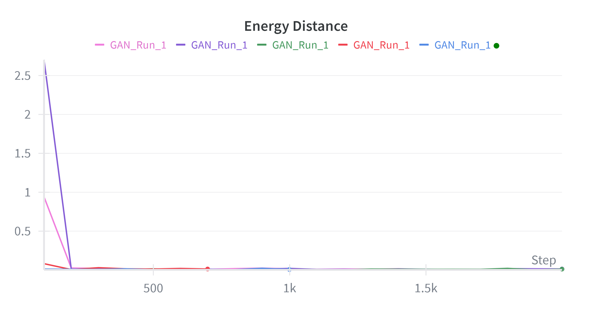
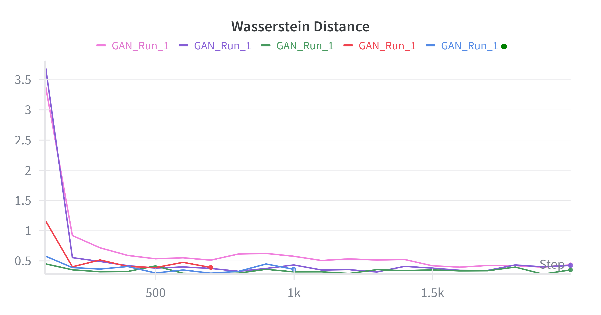
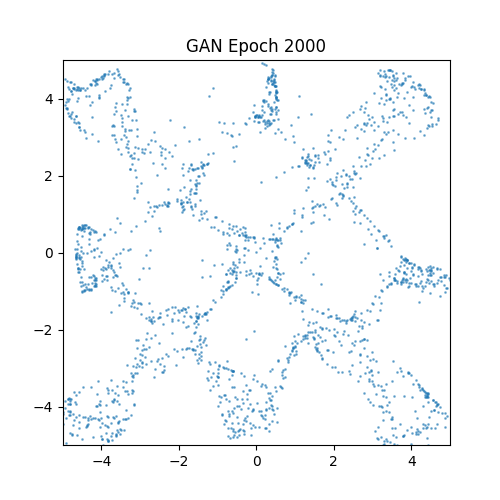
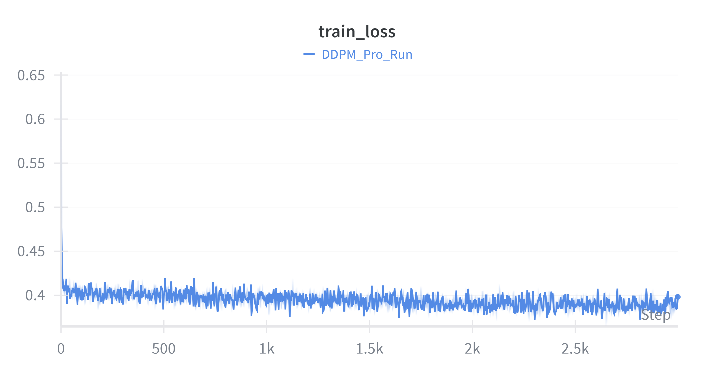
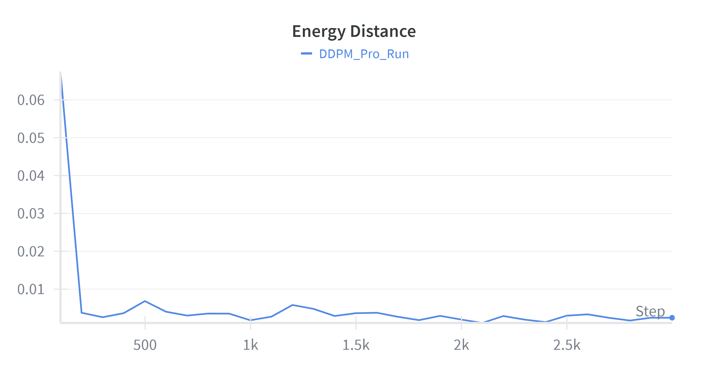
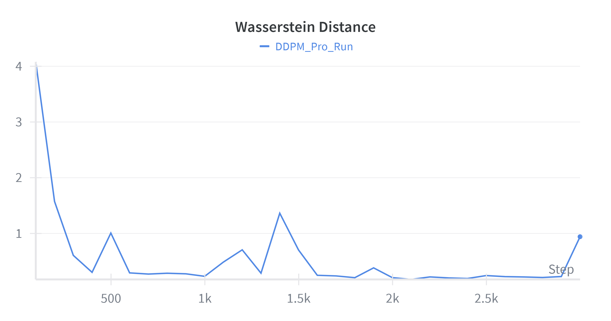
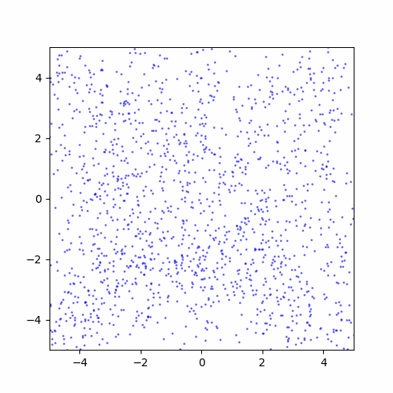
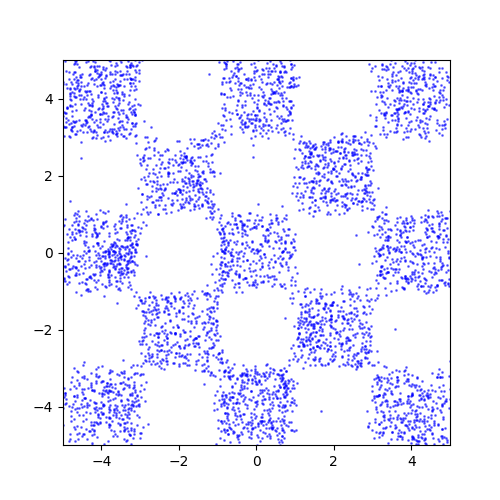

# Assignment 4: Generative Models

**學號**: 
**名字**:
**Kaggle Score**: -0.0013 

## Environment Setup
This project uses `uv` for dependency management.
To set up the environment, please run:
bash
uv sync

To reproduce the results, please execute the scripts in the scripts/ directory as required:
bash scripts/run_problem_1.sh   #GAN
bash scripts/run_problem_2a.sh  #DDPM Training
bash scripts/run_problem_2b.sh  #DDIM Inference & Plotting

##Problem 1: GAN
1. Implementation Details
Generator: A 3-layer MLP with ReLU activation.
Discriminator: A 3-layer MLP with LeakyReLU to prevent vanishing gradients.
Loss Function: BCEWithLogitsLoss.
Optimizer: Adam with learning rate 1e-4.

2. Learning Curves
Below are the Loss curve and the Metric (Energy Distance & Wasserstein Distance) curves logged during training.
 
  

3. Generated Results
Visualization of the generated checkerboard distribution by GAN.

##Problem 2a: Denoising Diffusion Probabilistic Models
1. Implementation Details
Architecture: A NoisePredictor with SinusoidalPositionEmbeddings for timestep information.
Key Strategy: We utilized a Linear Schedule (beta from 1e-4 to 0.02) over 1000 steps.
Model Improvement: We replaced Dropout with LayerNorm in the Residual Blocks. This significantly stabilized the gradients, allowing the model to capture sharp boundaries without the blurring effect of Dropout.
2. Learning Curves
The Energy Distance (ED) successfully dropped below 0.001, achieving high-fidelity generation.
 

3. Generation Process 
The following GIF demonstrates the reverse diffusion process, denoising from pure Gaussian noise to the target checkerboard distribution.

##Problem 2b: Denoising Diffusion Implicit Models (DDIM)
1. Effect of Sampling Steps
We compared the generation quality (ED/WD) across different denoising steps (1000, 500, 10, 1) using DDIM sampling with eta=0.
Observation: As the number of steps decreases, the approximation error increases, leading to higher Energy Distance.
Result: The 1000-step sampling yields the lowest distance, which matches our Kaggle submission strategy (Full Sampling).

2. Effect of Eta (Stochasticity)
We analyzed the impact of eta values 0.0, 0.25, 0.5, 0.75, 1.0 with fixed 50 steps.
Eta = 0 (DDIM): The process is deterministic. The generated samples are smoother but may lack diversity in sparse regions.
Eta = 1 (DDPM): The process is fully stochastic. It introduces more noise during sampling, which helps cover the mode but requires more steps to converge to a clean distribution.
Conclusion: For this precise checkerboard alignment task, lower eta (or full DDPM sampling with sufficient steps) provided better metric scores.

##Summary
In this assignment, we successfully implemented GAN, DDPM, and DDIM. Our best performing model was the DDPM with Linear Schedule and LayerNorm, trained for 3000 epochs. By using full 1000-step sampling, we achieved an Energy Distance of 0.00049 locally and a score of -0.0013 on the Kaggle Leaderboard.

